# Invoice Management System

A professional **Invoice Management System** built with Laravel. This system allows users to create, manage, and print invoices with ease. It also includes features such as user permissions, reports, notifications, and client management.

> 🔸 *Note: The application interface is currently available in Arabic only.*

## 🚀 Features

- 🧾 Create, edit, and delete invoices
- 📁 Manage sections and products
- 👥 Manage clients and users
- 🧑‍💼 Role-based access control (Admin / User)
- 📊 Generate detailed reports (paid / unpaid / partially paid)
- 🔔 Notifications for invoice status
- 📌 Archive and restore invoices
- 🖨️ Print invoices
- 📤 Export data to Excel
- 📥 Upload and manage attachments
- 📚 Comprehensive invoice history and logs
- 🔐 Secure authentication and access control

## 🛠️ Technologies Used

- **Laravel** (Latest version)
- **Bootstrap 5**
- **MySQL**
- **AJAX**
- **Blade Templating**
- **Spatie Permissions Package**

## 📸 Screenshots

> Add screenshots of the main pages (Dashboard, Invoice List, Create Invoice, Reports, etc.)

```
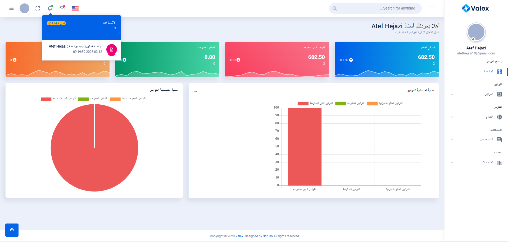
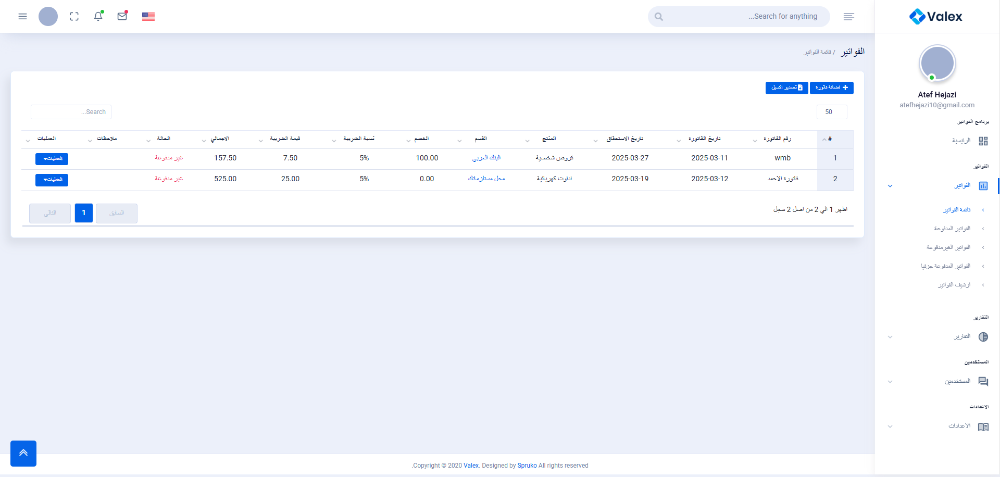
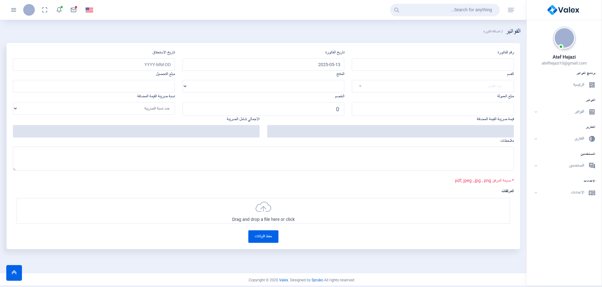
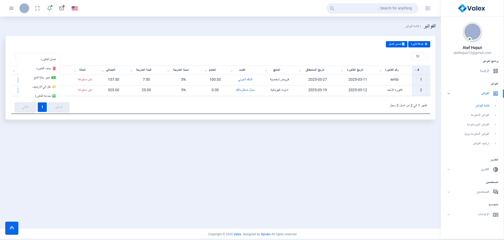
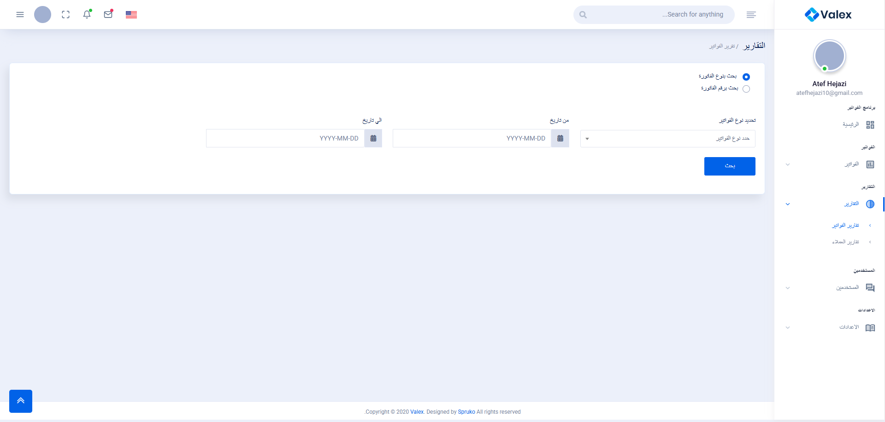
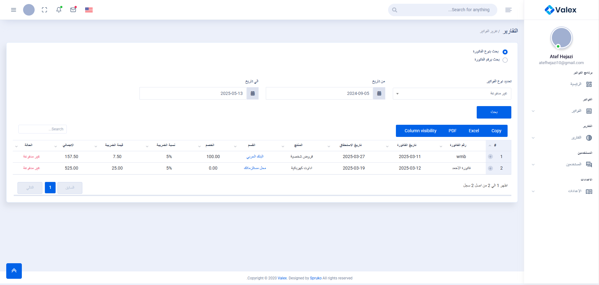
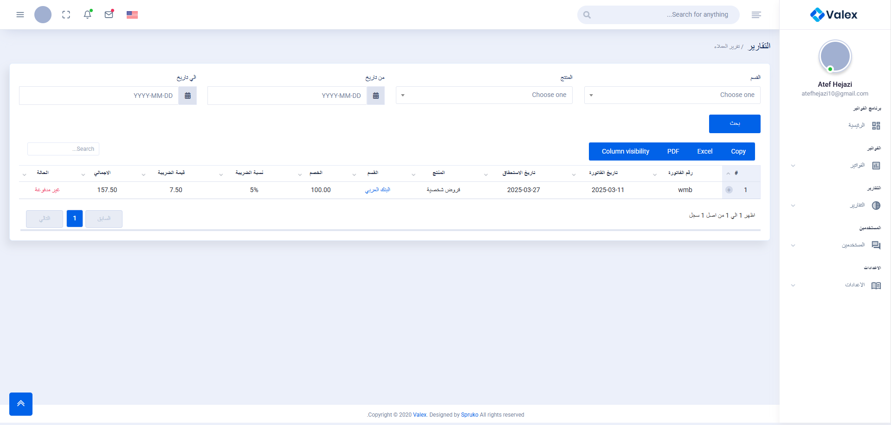
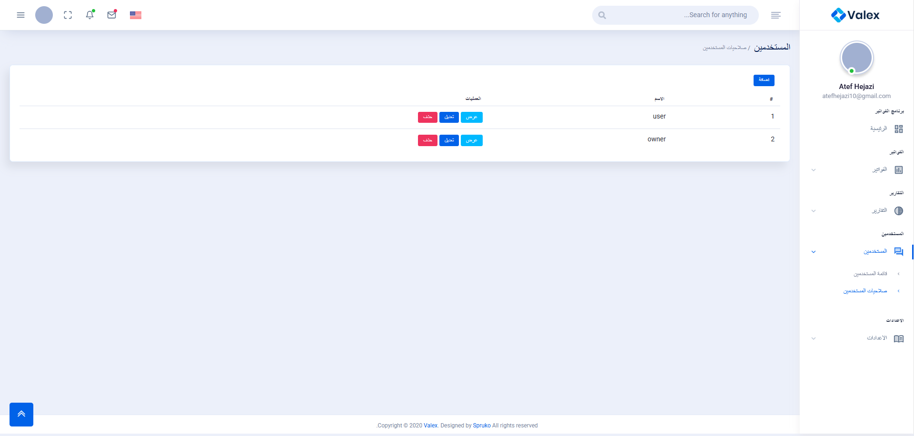
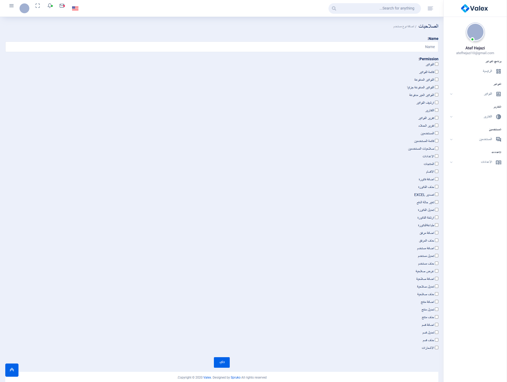
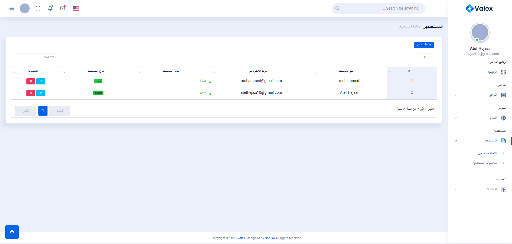
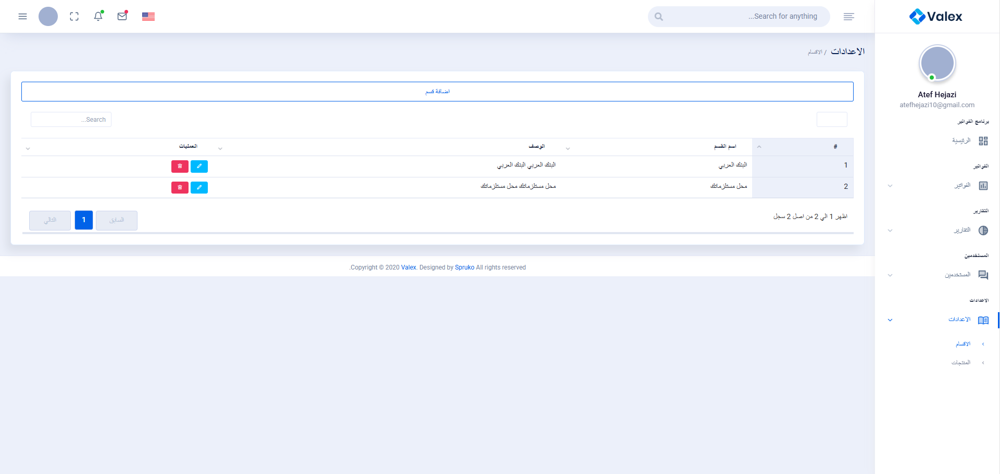
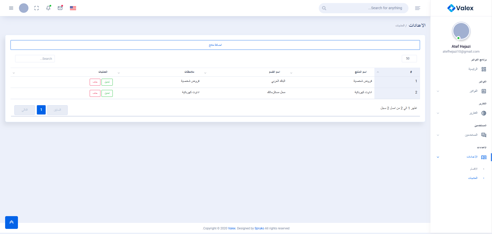
```

## 🎥 Demo Video

> Upload your video to YouTube or any hosting platform and add the link below:

[Watch Demo on YouTube](https://your-video-link.com)


## 📂 Installation

1. Clone the repository:
   ```bash
   git clone https://github.com/atefhejazi1/invoices.git
   ```

2. Install dependencies:
   ```bash
   composer install
   npm install && npm run dev
   ```

3. Create a `.env` file:
   ```bash
   cp .env.example .env
   ```

4. Generate application key:
   ```bash
   php artisan key:generate
   ```

5. Setup the database and run migrations:
   ```bash
   php artisan migrate --seed
   ```

6. Start the server:
   ```bash
   php artisan serve
   ```

7. Done! Open your browser at `http://localhost:8000`

## 📧 Contact

For any questions or suggestions, feel free to reach out to me:

- 💼 [Upwork Profile](https://www.upwork.com/freelancers/~019155515c3b5d1ea4)
- 💻 [LinkedIn](https://www.linkedin.com/in/atefhejazi)

---

📌 *This project was created as part of a Laravel training journey to build real-world, professional applications.*
